스프링 부트(Spring boot)

> ssafy 방학 끝나기 전에 일주일 동안 진득하게 들어야지 했는데 방학을 이틀 남겨 두고 부랴부랴 시작하는 게으름뱅이...ㅎ.ㅎ..
>
> 사실 2학기 프로젝트 들어갈 때 spring을 사용 할 가능성이 높아 워밍업으로 시작하는 프로젝트라 아무것도 모르고 시작하지만 그래도 이거라도 하고 들어가면 조금 더 덜 어색하지 않을까 싶어서 적어나가 봅니다😅
>
> 좀 늦은 감이 있지만...늦었다고 생각할 때가 내일의 나보다 빠른법.. 남들보다 빠르다고는 안했다...
>
> 이 글은 `김영한의 스프링 입문 - 코드로 배우는 스프링부트, 웹MVC, DB접근 기술` 강의를 바탕으로 작성되었습니다. 🙂
>
> ☝🏻스프링 부트 이노테이션을 외워두면 좋을것같습니다.😃


## 1. 프로젝트환경설정

> 항상 새로운 프로젝트를 시작할 때면 잔뜩 긴장도 되면서 기대도 되는 것 같습니다.
>
> 특히나 개발환경을 만들고 설치하는 과정이 저에게는 가장 오래걸리고 힘든 순간인 것 같습니다😂
>
> 이래서 다들 시작이 반이다 라고 하는 것 같은데 참 쉽지 않은것 같습니다. 
>
> 일단 자바를 뽑았으면 스프링 부트는 해봐야 겠죠?! 시작해 보겠습니다..🙂


### 1.1 프로젝트 환경설정

프로젝트 파일을 설치하고 프로젝트를 진행해 나가려면 일단 어떤 폴더 구조로 되어있는지 파악하는게 먼저겠쬬? 😎

스프링부트의 경우 `main`과 `test` 폴더를 제공하면서 `main`에서는 진짜 프로젝트의 주요 코드를 작성하고 `test`에는 이 프로젝트를 테스트 할 수 있는 코드가 들어가게 됩니다. 

이처럼 요즘 개발 트렌드에서 `test`코드가 매우 중요하다는 것을 알 수 있습니다. 

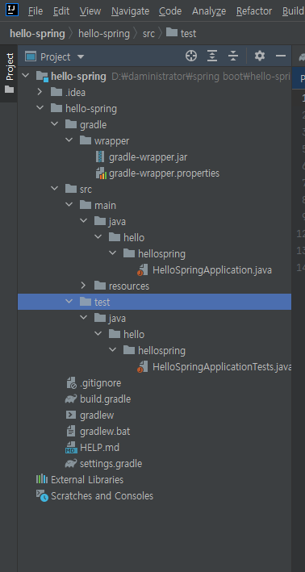

`resources`는 자바 코드를 제외한 xml, 설정파일, html등등이 다 여기에 들어가 있습니다.

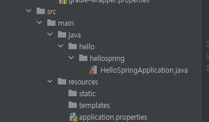

여기서 중요한 파일이 있습니다.

`build.gradle` 

옛날에는 여기에 사람이 일일이 코딩을 해주던지, 아님 잘 만들어놓은 코드를 복사해 붙여 넣었는데 `스프링부트의 출현`으로 일일이 코드를 입력하지 않아도 `htpps://start.spring.io` 이 사이트에서 내가 원하는 프로젝트를 입력하면 자동으로 파일을 만들어 넣어줍니다. 

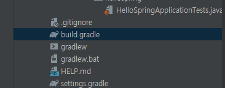

- `gradle` : 버전 설정, 라이브러리  떙겨 오는 프로그램 이라고 간단하게 생각하고 넘어갑시다.  🙂

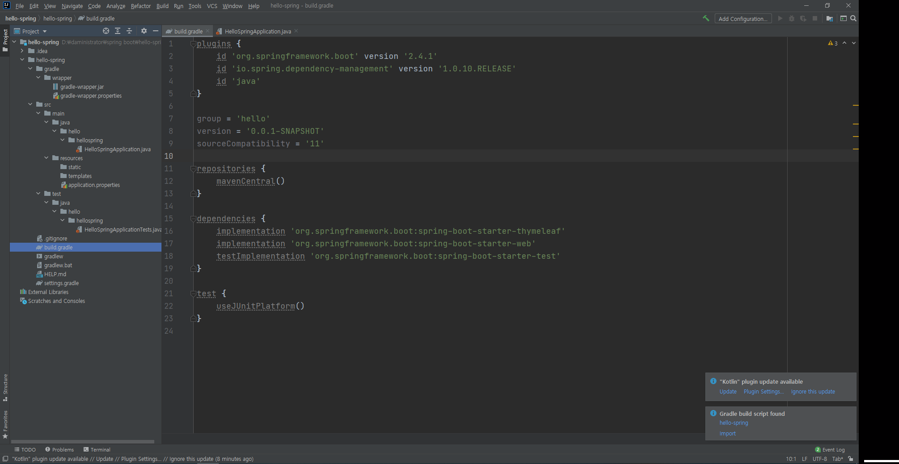


**휴...생각보다 환경설정하는 게 오래걸렸습니다...😂😂** 

일단 `java11`을 다운 받고 그 다음 `intelli J`를 다운 받고 경로 설정 하고 `intelli J`에 환경설정을 바꿔주면서 `java`경로 설정이 안됐는지 실행하는데도 한참이 걸렸습니다...ㅎㅎ.....

아무튼 실행을 하게 되면 

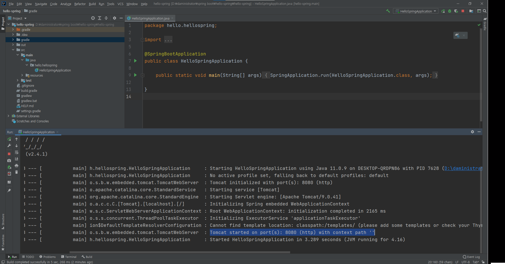

http에 연결이 됐다고 잘 뜹니다. 😅

여기서 `localhost:8080`이라고 인터넷 주소창에 입력하면 

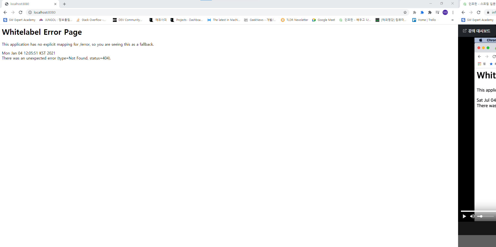

에러 페이지가 뜹니다😅

이 페이지가 뜨면 성공한겁니다 ㅎㅎㅎ....

서버를 끄고 다시 새로고침을 하면 서버가 없다고 나오는 창이 뜹니다.

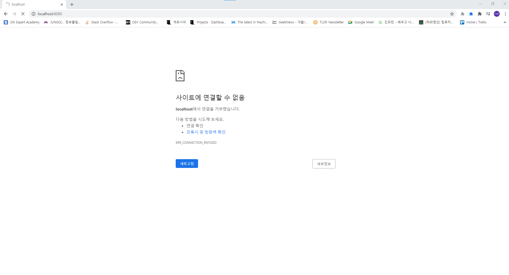

위에까지가 프로젝트 환경 설정에 성공 했다는 뜻입니다.  

돌아가는 원리를 살펴 보면 `main`메서드를 실행하면 `HelloSpringApplication`이 실행되고 톰캣이라는 엔진을 내장하고 있어 사이트가 뜨는 원리입니다.

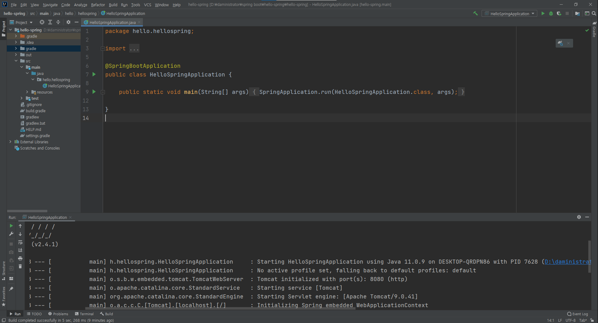


이제 프로젝트를 시작할 준비는 끝났습니다..ㅎㅎ....~~드디어..~~


### 1.2 라이브러리 살펴보기

> 깊이 있게 어떤 라이브러리가 어떤 의존관계가 있는지 깊이 있게 다 알고 갈 필요 없이 감만 잡고 가도 나중엔 다 이해된다고 합니다😂

먼저 `build.grable`을 열어보면 

- `thymeleaf` : template 엔진 , html 만들어주는 라이브러리
- `web` : 우리가 개발할 어플리케이션 
- `test` : 우리가 세팅은 안했지만 자동으로 들어온 test 

이렇게 3개 밖에 없어 보이는데 

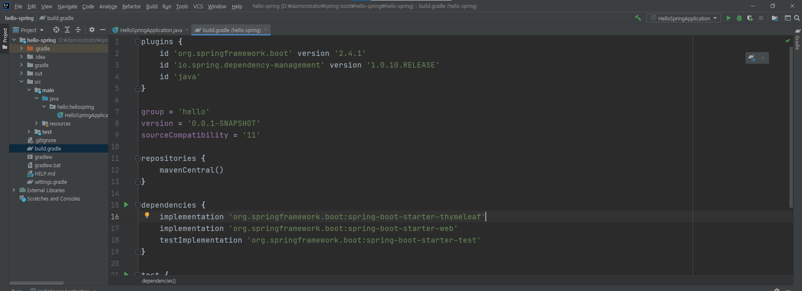

실제 라이브러리는 `External Libraries`에 떙겨져 들어와 있습니다. 

엄청 많은 라이브러리가 들어있습니다. 

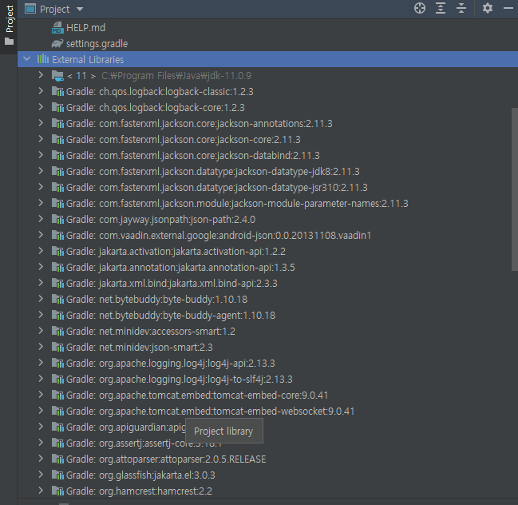

빌드툴들은 의존관계를 다 관리해줍니다. 

`starter-web`을 가져오면 그것을 수행하기 위한 의존관계에 있는 라이브러리를 다 떙겨 옵니다. 

아래의 빨간 버튼을 눌러보면 

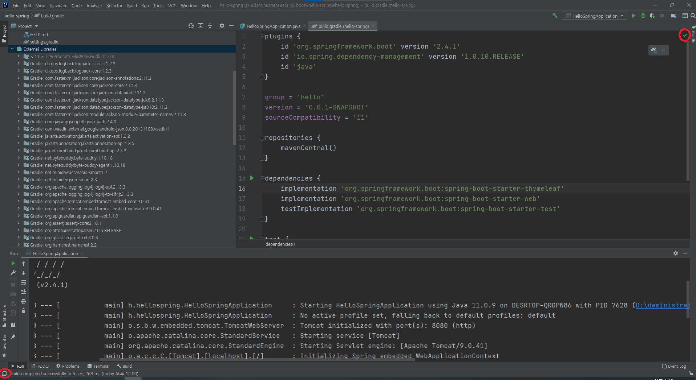

`Gragdle`이 뜨는데 여기서 라이브러리들의 의존관계를 확인해 보면

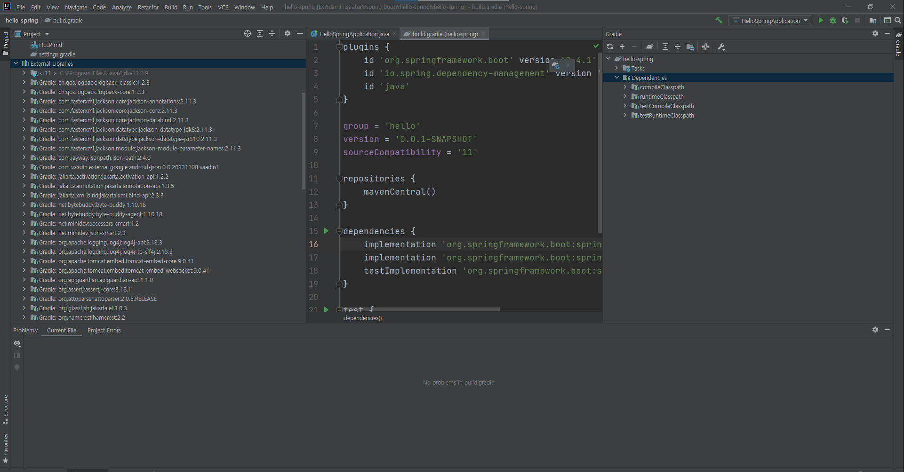

라이브러리의 디렉토리를 까보면 의존관계가 있는 다양한 라이브러리를 볼 수 있습니다. 

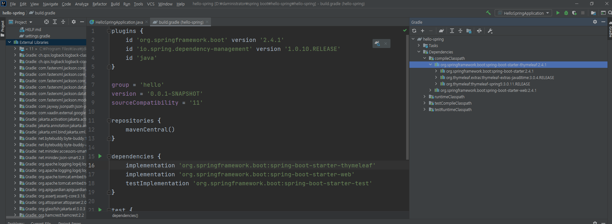

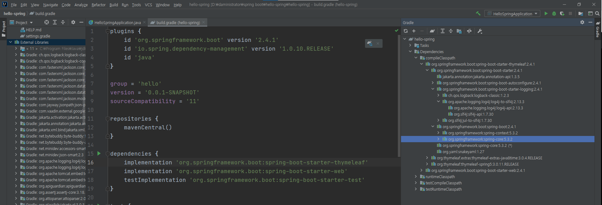


`logging`의 경우 , 현업의 경우 log값을 이용해 심각한 에러를 따로 모아서 관리 합니다. 

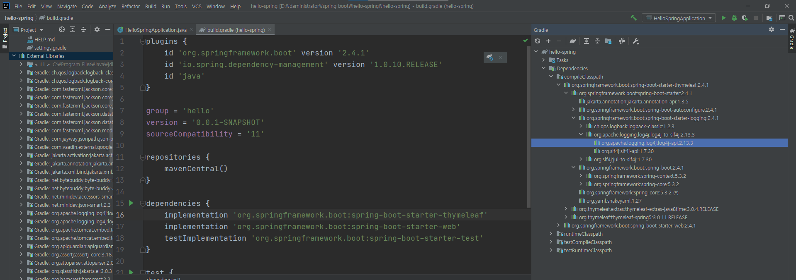

log 에 대한 궁금증이 생기면 `slf4j`와 `logback`으로 검색해 보시길 추천해 드립니다. 


### 요약하자면

**스프링부트 라이브러리**

- spring-boot-starter-web 
  - spring-boot-starter-tomcat :톰캣(웹서버)
  - spring-webmvc : 스프링 웹 MVC
- spring-boot-starter-thymeleaf : 타임리프 템플릿 엔진(View)
- spring-boot-starter(공통) : 스프링 부트 + 스프링 코어 + 로깅
  - spring-boot
    - spring-core
  - spring-boot-starter-logging 
    - logback, slf4j

**테스트 라이브러리**

- spring-boot-starter-test 
  - junit : 테스트 프레임워크 
  -  mockito : mock 라이브러리 
  - assertj : 테스트 코드를 좀 더 편하게 작성하게 도와주는 라이브러리
  - spring-test : 스프링 통합 테스트 지원 


### 1.3 View 환경설정

> 위에서 환경설정 및 프로그램이 어떤 라이브러리를 끌어와서 동작하는지 대충 배웠다면 여기서는 확실히 화면에 에러페이지가 아닌 어떤 페이지를 보여줄 수 있도록 해보겠습니다. 🙂

#### Welcome Page 만들기

- resources/static/index.html

  - 스프링 부트가 제공하는 Welcome Page 기능
  - `static/index.html`을 올려두면 Welcome page 기능을 제공한다.

  - 위에 경로에 `index.html`파일을 만들어 주면 개발환경에서 자동적으로 `home`화면 경로로 인식해 보여줍니다. 

```html
<!DOCTYPE HTML>
<html>
	<head>
		<title>Hello</title>
    	<meta http-equiv = "Content-Type" content="text/html; charset=UTF-8"/>
	</head>
    <body>
        Hello
        <a href="/hello">hello</a>
    </body>
</html>
```

spring은 굉장히 광범위하고 넓어서 모든 정보를 다 암기 할 수 없습니다.

그렇다면 필요한 정보를 찾아야 하는데요, 검색 팁을 알려 드리도록 하겠습니다.

`spring.io`에 들어갑니다.

상단의 `project`에 `spring-boot`를 클릭해 들어가셔서 `ctrl + f`를 눌러 키워드를 검색해 필요한 정보를 읽습니다. 

https://docs.spring.io/spring-boot/docs/current/reference/html/spring-boot-features.html#boot-features


#### thymeleaf 템플릿 엔진

> 위의 Welcome Page 의 경우에는 내가 적어준 `index.html`파일을 그냥 던져서 뿌려주기만 한 것입니다. 하지만 이건 프로그래밍이라고 하기 어렵겠죠🙄

- thymeleaf 공식 사이트 : https://www.thymeleaf.org/
- 스프링 공식 튜토리얼 :  https://spring.io/guides/gs/serving-web-content/
- 스프링부트 메뉴얼 : https://docs.spring.io/spring-boot/docs/2.3.1.RELEASE/reference/html/spring-boot-features.html#boot-features-spring-mvc-template-engines


- 이제 동작하고 프로그래밍 되는 화면을 만들어 보도록 하겠습니다.😶

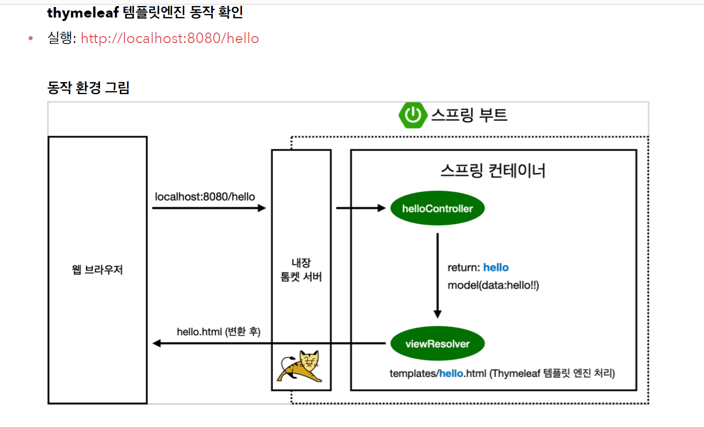

url `localhost:8080/hello`에서 `hello`라는 값이 `helloController`에 던져지면 그 안에 정의해둔 `public String hello(Model model)`함수가 실행 되게 됩니다. 

```java
// src/main/java/hello/hellospring/controller/HelloController.java

package hello.hellospring.controller;

import org.springframework.stereotype.Controller;
import org.springframework.ui.Model;
import org.springframework.web.bind.annotation.GetMapping;

@Controller
public class HelloController {
	
    // Get : get방식으로 데이터를 던져줌 
    @GetMapping("hello") 
    public String hello(Model model){
        model.addAttribute("data", "hello!!") ;
        return "hello" ;
    }
}
```

스프링이 `model`이라는 것을 만들어주는데 이 `model`에 `addAttribute`해서 `key`는 `"data"`이고 `value`는 `"hello!!"`로 값을 만들어 주고 

`return "hello"` 하는데 이 때 `"hello"`는 `resources/templates/hello.html`과 동일합니다. 

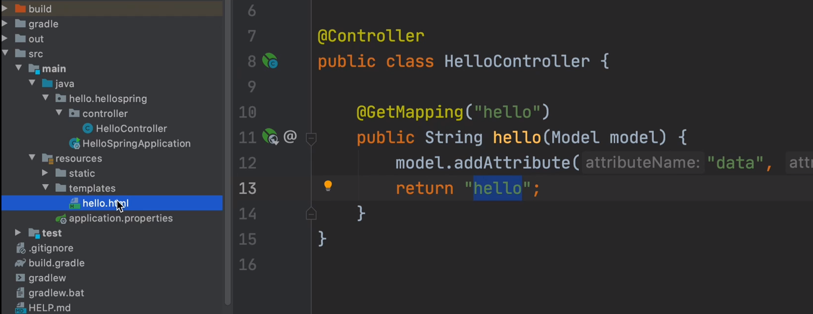


#### 정리하면 

- 컨트롤러에서 리턴 값을오 문자를 반환하면 뷰 리졸버(viewResolver)가 화면을 찾아서 처리합니다. 
  - 스트링 부트 템플릿 엔진 기본 viewName 매핑
  - `resources:templates/` + {VIewName} + `.html`

> 참고 : `spring-boot-devtools`라이브러리를 추가하면, `html`파일을 컴파일만 해주면 서버 재시작 없이 View 파일 변경이 가능합니다. 
>
> intelli J 컴파일 방법 : 메뉴 build -> Recompile


src / main / java / hello / hellospring/controller/ helloController 

데이터를 처리해 주는 controller 부분 -> model

- `@GetMapping("url주소")` : url 주소 
- `attributeValue` : 넘겨줄 값 

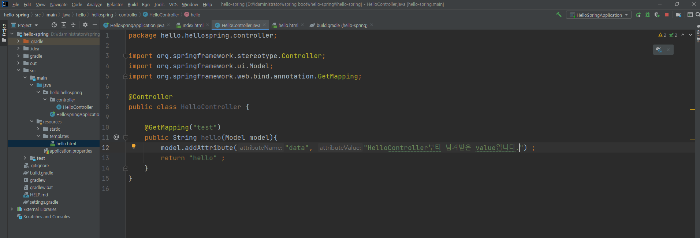


데이터 처리후 출력 해 주는 부분 

resources / templates / {ViewName} + . html 

- 이 때 `template 라이브러리 ` 링크를 걸어주고 
- p태그와 매핑해서 src / main / java / hello / hellospring/controller/ helloController 에서 `model의 key` 이름으로 받아 화면에 뿌려준다. 

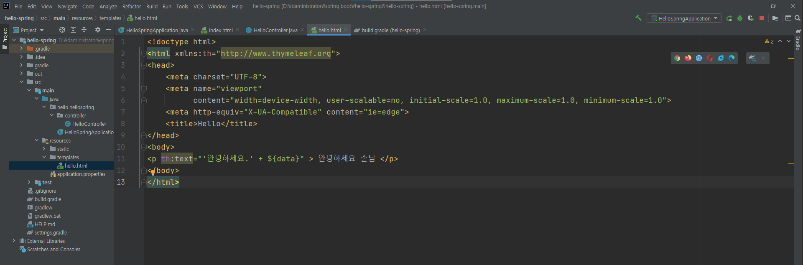


### 1.4 빌드하고 실행하기

콘솔로 이동

1. `gradlew.bat build`
2. `cd build/libs`
3. `java -jar hello-spring-0.0.1-SNAPSHOT.jar` 
4. 실행 확인 


서버 배포할 떄는 `hello-spring-0.0.1-SNAPSHOT.jar`  이 파일만 복사해서 서버에 넣어주고 이 파일을 실행 시켜주시면 됩니다. 


만약에 잘 안된다면 build폴더를 지우고 다시 설치해 봅시다. 

`gradlew.bat clean build` 


## 2. 스프링 웹개발 기초

> 이제 본격적으로 개발을 시작해 봅시다.🤨
>
> 너무 부담 갖지 말고 어떤 원리로 동작하는지만 잡고 가도 반은 성공한거라고 생각합니다.🤔

웹을 개발한다는 것은 크게 3가지 방법이 있습니다. 

1. 정적 컨텐츠

   서버에서 뭐 하는 거 없이 그냥 파일을 그대로 웹브라우저에 내려줌 

2. MVC와 템플릿 엔진 

   가장 많이 하는 방식입니다. html을 그냥 주는게 아니라 서버에서 프로그래밍을 해서 html을 동적으로 바꿔서 내려주는 것 

   그것을 하기 위해 `controller`,`model`, `view` 라고 해서 MVC 라고 합니다. 

   정적 컨텐츠와의 차이는 정적 컨텐츠는 그대로 고객(웹브라우저)에게 전달해주는 반면 뭔가 서버에서 변형을 해서 고객(웹브라우저)에게 전달해주는 방식 

3. API

   만약 안드로이드나 아이폰 클라이언트와 개발해야할 때, json이라는 데이터 형식으로 클라이언트에게 전달해주는 방식 

   json으로 데이터만 넘겨주면 고객(클라이언트)이 알아서 화면에 그리는 방식을 이용하고 있습니다. 

   또한 서버끼리 통신 할 떄 API방식을 사용합니다. 


### 2.1 정적 컨텐츠

- 스프링 부트 정적컨텐츠 
- https://docs.spring.io/spring-boot/docs/2.3.1.RELEASE/reference/html/spring-boot-features.html#boot-featrues-spring-mvc-static-content

아래의 사진처럼 매우 잘 나타나 있습니다. 

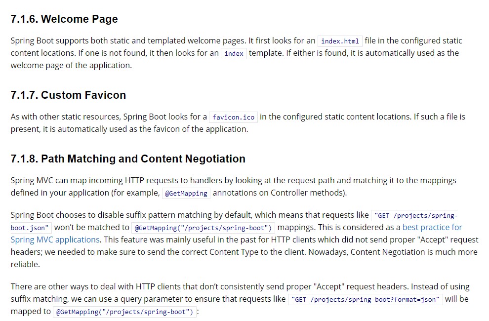

- `static`을 인식하는 폴더에 `.html`파일을 잘 만들어주고 

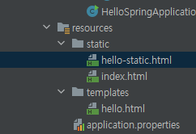

- `localhost:8080/파일명.html`로 서버를 열어 확인해 보면 정적 파일이 잘 열리는 걸 확인 할 수 있습니다.

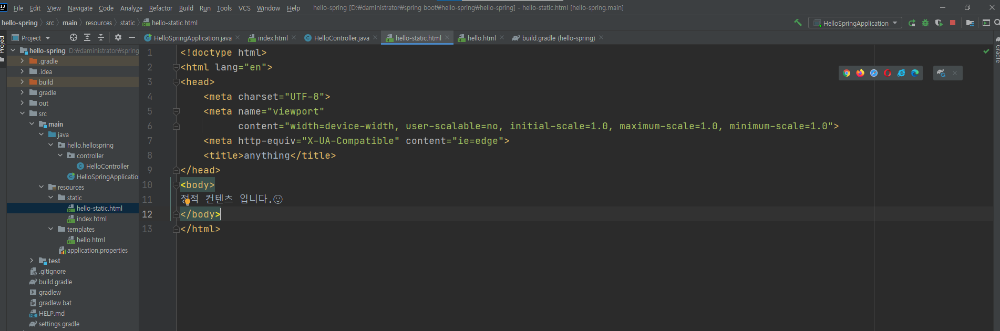

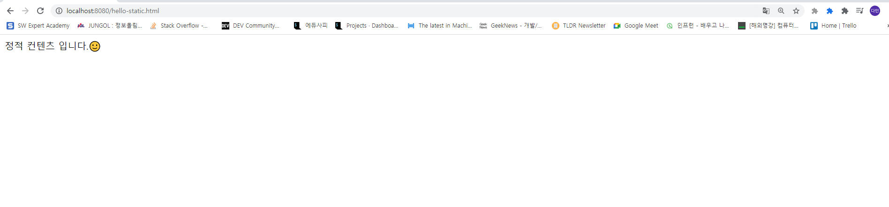


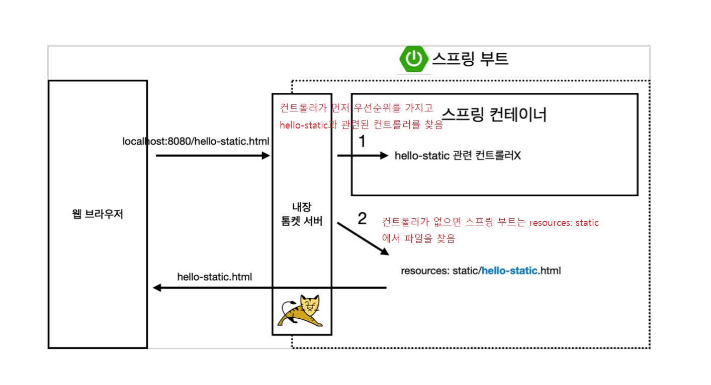


### 2.2 MVC와 템플릿 엔진

- MVC : Model, View, Controller 


#### controller 

서버 뒷단에 관련된 일을 처리 , model에서 넘겨준 데이터를 view에 넘겨주는 일 

```java
@ Controller 
public class HelloController {
    @GetMapping ("hello-mvc")
    public String helloMvc(@RequestParam("name") String name, Model model) {
        model.addAttribute("name", name) ;
        return "hello-template" ;
    }
}
```


#### view 

화면에 관련된 일만 처리

resources / template/hello-template.html

```html 
<html xmlns:th="http://www.thymeleaf.org">
    <body>
        <p th:text =" 'hello' + ${name}"> hello! empty </p>
        </p>
    </body>
    
</html>
```


`<p th:text="'Hello.' + ${name}" > Hello! empty </p>`

서버 없이 그냥 html 파일을 열어 볼 떄 화면에 출력되는 정보로 ` Hello! empty`가 출력 됩니다. 

실제 서버를 타고 돌면 `<p th:text="'Hello.' + ${name}" > Hello! empty </p>` 테그 안에 들어있는 값 으로 바뀌게 됩니다. 


url에 아무것도 입력하지 않으면 에러페이지가 뜹니다.

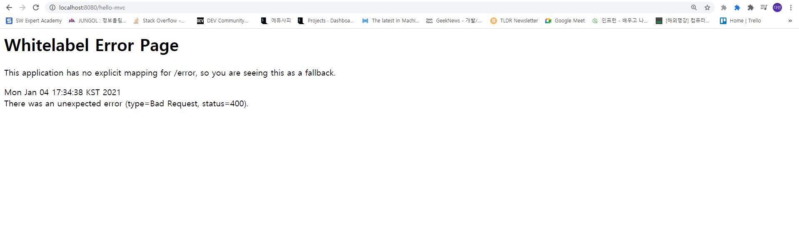

왜냐하면 우리는 우리는 처리할 로직에서 `@RequestParam`로 인자를 받기로 했거든요

```java
@GetMapping("hello-mvc")
public String helloMvc(@RequestParam("name") String name, Model model){
    model.addAttribute("name", name) ;
    return "hello-template" ;
}
```

- `?mame=`인자를 받은 후 

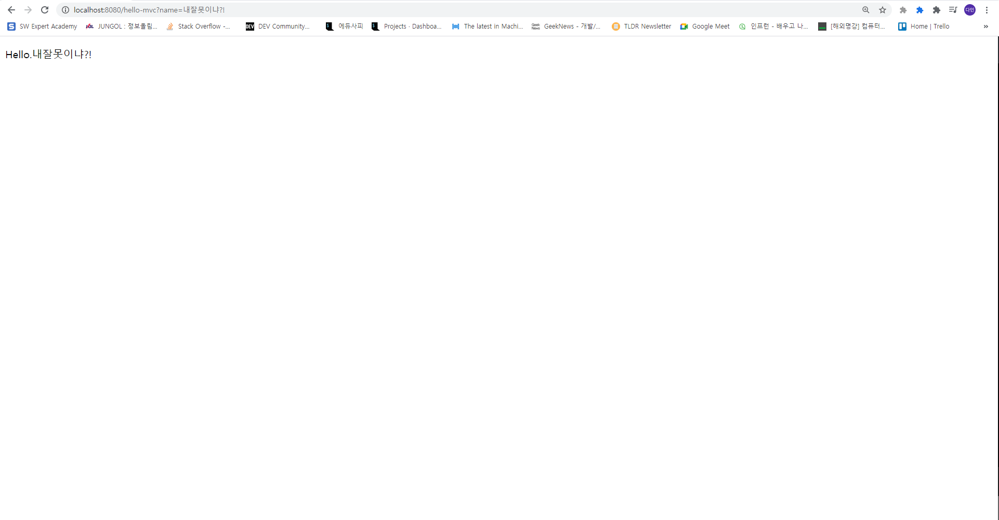


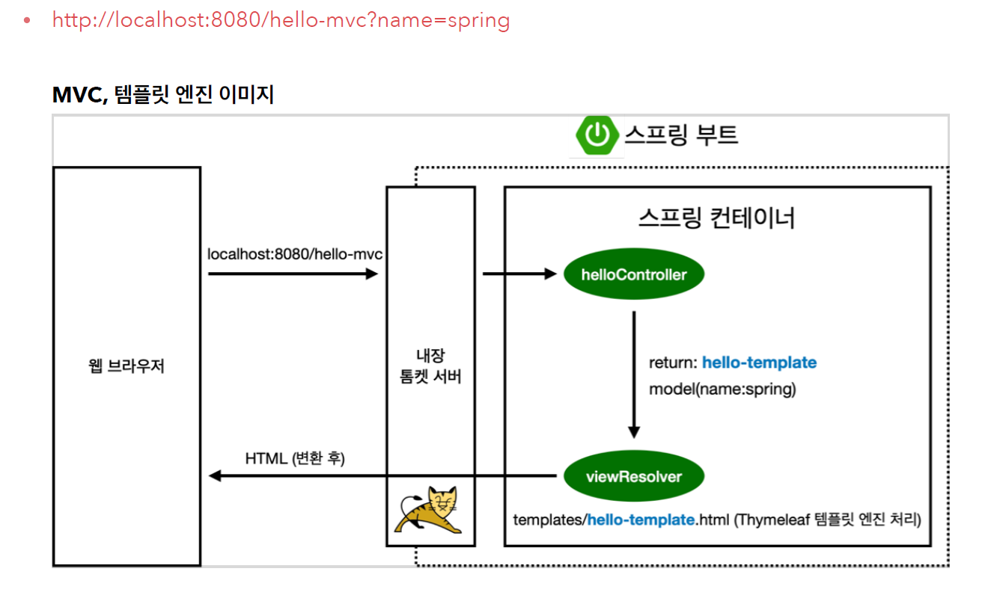

- viewResolver : 화면과 관련된 해결자가 동작 

- 변환한 HTML을 웹 브라우저에 반환 


### 2.3 API

- ResponseBody : http에서 header부와 body가 존재하는데 그 떄 통신 body부에 아래 코드 내용을 직접 넣어주겠다는 의미입니다. 

```java
@GetMapping("hello-string")
//야기서 중요한 한줄
@ResponseBody
public String helloString(@RequestParam("name") String name) {
    return "hello" + name ;//"hello spring" 내가 요청한 클라이언트에 그대로 내려감
}
```

차이점은 `VIew`이런거 없고 문자가 그대로 내려갑니다.

소스를 보면 알 수 있습니다.

내가 적었던 string 값이 html 태그없이 그대로 내려간 것을 볼 수 있습니다.

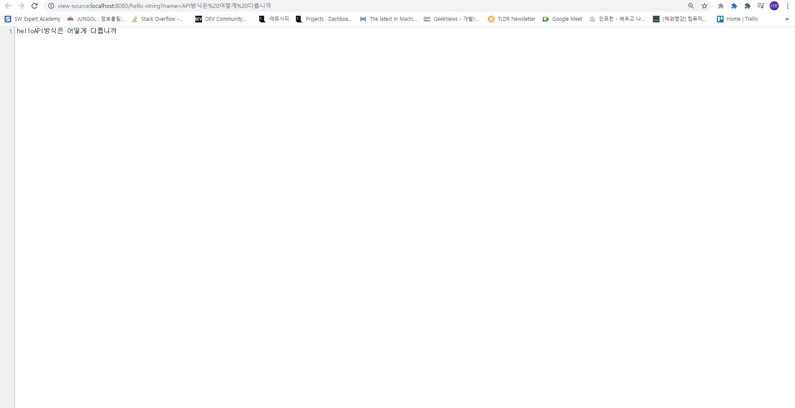

template엔진에서 조작해서 내려준 mvc와는 다른게 api는 글자 그대로를 내려보내줍니다. 

웹에서는 `json`형식으로 객체를 내려보내주는 것을 확인 할 수 있습니다. 

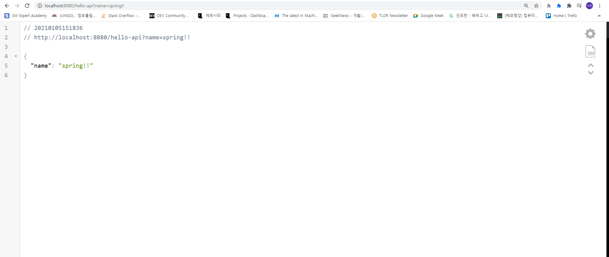


그렇다면 `json`은 뭘까요?

json은 `key`와 `value`로 구성되어있는 자료 입니다. 굉장히 간단합니다. 

물론 json의 정의가 이렇게 간단한 건 아니지만 일단 이렇게 알고 넘어가보도록 합시다 😏


```java
	@GetMapping("hello-api")
    @ResponseBody
    public Hello helloAPI(@RequestParam("name") String name) {
        Hello hello = new Hello();
        hello.setName(name);
        return hello ;
    }

    static class Hello {
        private String name ;

        public String getName() {
            return name ;
        }

        public void setName(String name) {
            this.name = name ;
        }
    }
```

- 객체를 넘겨줄 경우, 기본 default 가 json방식으로 만들어서 응답에 반환하겠다가 규칙입니다. 
  - `ResponseBody`를 사용
  - HTTP의 BODY에 문자 내용을 직접 반환
  - `viewResolver`대신에 `HttpMessageConverter`가 동작 
  - 기본 문자 처리 : `StringHrrpMessageConverter`
  - 기본 객체 처리: `MappingJackson2HttpMessageConverter`
    - `Json`이 아니라 `jackson`?? 
      - 객체를 json으로 바꿔주는 라이브러리 
      - 물론 google이 만든 라이브러리도 있지만 일단 기본디폴트 값을 사용
  - byte 처리 등등 기타 여러 HttpMessageConverter가 기본으로 등록되어 있음 
  - 참고 : 클라이언트의 HTTP Accept 해더와 서버의 컨트롤러 반환 타입 정보 둘을 조합해서 `HttpMessageConverter`가 선택된다. 

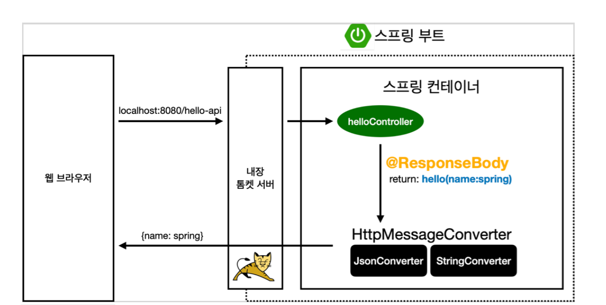


## 3. 회원관리 예제 - 백엔드 개발

> 드디어 회원관리 예제를 만들어 봅니다.
>
> 회원도메인과 회원도메인 객체를 저장하고 불러오는 회원 레퍼지토리를 만들기!

### 3.1 & 3.2 비지니스 요구사항 정리

- 데이터 : 회원ID, 이름 
- 기능 : 회원등록, 조회
- 아직 데이터 저장소가 선정되지 않음(가상의 시나리오)


#### 일반적인 웹 애플리케이션 계층 구조 

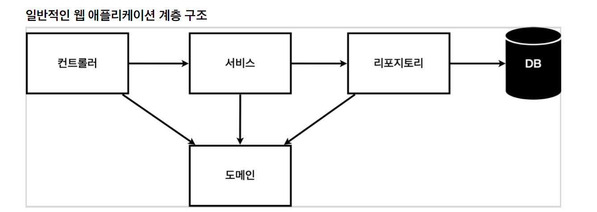

- 컨트롤러 : 웹 MVC의 컨트롤러 역할
- 서비스 : 핵심 비지니스 로직구현 
  - 같은 회원정보로 중복 가입이 안된다던지에 관한 로직이 들어감 
- 리포지토리 : 데이터베이스에 접근, 도메인 객체를 DB에 저장하고 관리
- 도메인 : 비지니스 도메인 객체
  - 예 ) 회원, 주문, 쿠폰 등등 주로 데이터베이스에 저장하고 관리됨 


#### 클래스 의존관계 

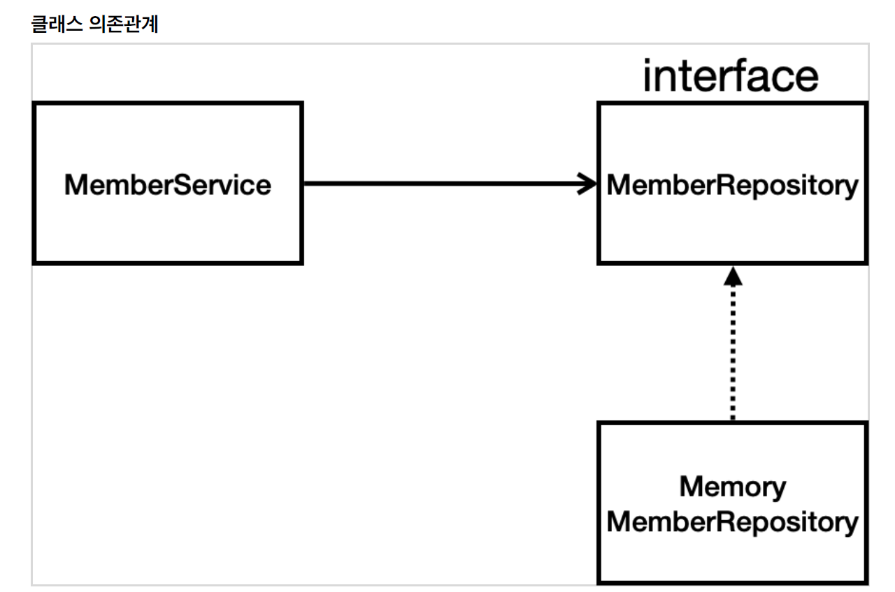

- 아직 데이터 저장소가 선정되지 않아서, 우선 인터페이스로 구현 클래스를 변경 할 수 있도록 설계 
  - 메모리 구현체로 만들어 일단 구현을 해내고 
  - 향후에 이 부분을 바꿔 끼울것입니다
    - 바꿔 끼울려면 인터페이스가 필요하기 떄문에 사용하는 것입니다. 
- 데이터 저장소는 RDB, NoSQL 등등 다양한 저장소를 고민중인 상황으로 가정
- 개발을 진행하기 위해서 개발 단계에서는 구현체로 가벼운 메모리 기반의 데이터 저장소 사용 

 

### 3.3 회원 리포지토리 테스트 케이스 작성 

개발한 기능을 실행해서 테스트 할 때 자바의 main메서드를 통해서 실행하거나, 웹 애플리케이션의 컨트롤러를 통해서 해당 기능을 실행한다. 

이러한 방법은 준비하고 실행하는데 오래 걸리고, 반복 실행하기 어렵고 여러 테스트를 한번에 실행하기 어렵다는 단점이 있다. 

자바는 JUnit이라는 프레임워크로 테스트를 실행해서 이러한 문제를 해결한다. 

